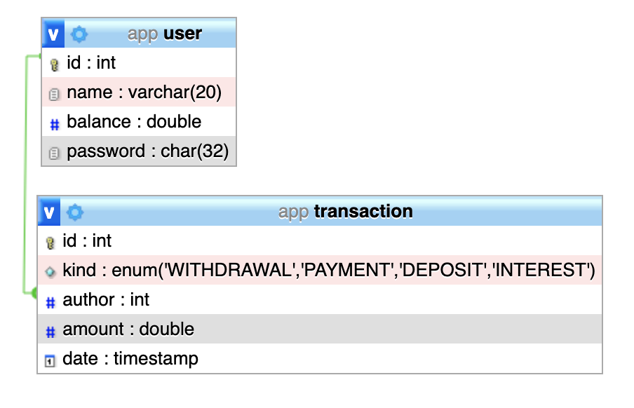

# Mike Bank 

## Rodando a aplicação 

Os requisitos são: `docker-compose`, `yarn` e `node` instalados na máquina.

Caso tudo esteja instalado, rode os comandos: `make db-start`, `make server-start` e `make client-start`. 

O banco de dados subirá na porta `3306` com o admin em `localhost:8080`, o servidor subirá na porta `3001` e o client
na porta `3000`. 

## Sobre o projeto
Batizado como Mike Bank em homenagem à meu gato, o projeto é uma aplicação que simula algumas transações bancárias. 

Construído em cima do padrão MVC, o projeto tem sua arquitetura definida com as layers de Model e Controller sendo responsabilidades do servidor rodando em Node, a layer de View sendo responsabilidade da aplicação escrita em React e a escolha do banco foi utilizar uma imagem docker do MySQL.

A documentação específica do frontend e do backend estão em seus diretórios: [frontend](https://github.com/luischoma/mike-bank/tree/master/client) e [backend](https://github.com/luischoma/mike-bank/tree/master/server).

## Sobre o Banco de Dados

Apesar de pouco ortodoxo, a escolha foi de utilizar MySQL junto ao Node. A motivação desta escolha baseia-se no fato de que,
por se tratar de uma aplicação bancária, não gostaria que o sistema ficasse suscetível à 'eventual consistência' de bancos de dados não-relacionais.

O modelo gerado pelo PhPMyAdmin pode ser visto abaixo:

O banco é responsável por realizar, a cada 24H, o evento de rentabilizar(configurado em 10%!!) o dinheiro atual da conta. Hoje, estas configurações estão hardcoded no SQL (como um evento SQL).
